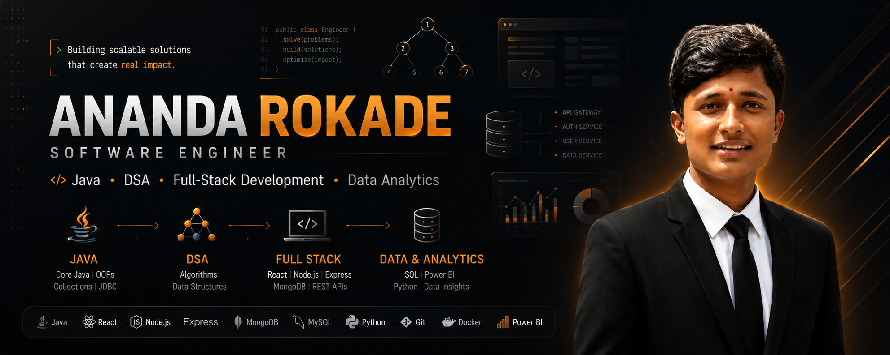

  

  

---

## `01` — WHO AM I?

### Ananda Rokade
**Software Engineer**

- 🎓 Engineering student with a strong foundation in **Java & Data Structures**
- 🧠 **350+ DSA problems solved**
- 🌐 Full-Stack development using the **MERN ecosystem**
- 📊 Data Analytics & Business Intelligence using **SQL, Power BI & DAX**
- 💡 Interested in building practical, scalable and problem-driven software

I enjoy turning **problems into structured solutions** — from designing algorithms and backend systems to building interactive applications and extracting meaningful insights from data.

My current focus is becoming a stronger **Software Engineer** by combining **problem-solving, development, databases and analytical thinking**.

---

## `02` — ENGINEERING STACK

### ⚡ Core Engineering

  

### 🧠 Problem Solving

**Data Structures** • **Algorithms** • **Problem Solving** • **OOP** • **DBMS**

 

### 🌐 Full-Stack Development

  

### 📊 Data & Business Intelligence

**SQL** • **Power BI** • **DAX** • **Data Analysis** • **Data Visualization** • **Excel**

 

### 🛠 Tools

---

## `03` — WHAT I BUILD

<table>
<tr>
<td width="50%" valign="top">

### 🧩 Software Engineering

Building full-stack applications with:

- React.js
- Node.js
- Express.js
- MongoDB
- REST APIs
- Java

</td>

<td width="50%" valign="top">

### 📊 Data & BI

Working with data to:

- Clean and validate datasets
- Analyze business patterns
- Build Power BI dashboards
- Write SQL queries
- Generate actionable insights

</td>
</tr>

<tr>
<td width="50%" valign="top">

### 🧠 DSA & Problem Solving

**350+ problems solved**

Focused on:

`Arrays` `Strings` `Hashing` `Binary Search`

`Linked Lists` `Stacks` `Queues` `Trees` `Graphs`

`Recursion` `Dynamic Programming`

</td>

<td width="50%" valign="top">

### 🚀 Engineering Mindset

I focus on:

`Clean Code`

`Logical Thinking`

`Scalable Solutions`

`Continuous Learning`

`Practical Problem Solving`

</td>
</tr>
</table>

---

## `04` — FEATURED WORK

### 📊 Comprehensive Sales Dashboard

**Power BI • DAX • Excel**

Interactive Business Intelligence dashboard for analyzing revenue, orders, profitability, customer spending, products, channels and geographic performance.

**Highlights**

- 💰 **$1.2B+ revenue** analyzed
- 📦 **64K+ orders** analyzed
- 📈 **37.36% profit margin** analyzed
- 📊 Interactive KPIs and visualizations
- 🔎 Trend and profitability analysis

🔗 [View Repository](https://github.com/BROBeliver/Sales_DashBoard)

---

### 👥 Customer Behavior Dashboard

**Power BI • DAX • Excel**

Interactive dashboard focused on customer demographics, purchasing patterns, revenue, sales and subscription behavior.

**Highlights**

- 👤 Customer segmentation
- 📊 Interactive KPI cards
- 🎛️ Slicers and visual analytics
- 🔄 Customer retention analysis
- 🛍️ Product and purchasing analysis

🔗 [View Repository](https://github.com/BROBeliver/Customer-Behavior-Dashboard)

---

## `05` — EXPERIENCE

### 💻 MERN Stack Intern
**Cravita Technologies India Private Limited**

Worked on full-stack web applications using the MERN stack, contributing to:

**React.js • Node.js • REST APIs • MongoDB**

- Developed reusable UI components
- Integrated RESTful APIs
- Worked with MongoDB
- Debugged application issues
- Collaborated with the development team
- Improved application performance and user experience

---

### 📊 Data Analytics Intern
**Enrichepro Software Pvt. Ltd.**

Worked on data analysis and visualization using:

**Python • SQL • Data Analytics**

- Analyzed **10,000+ records**
- Identified trends, patterns and meaningful insights
- Performed data validation and analytical reporting
- Created data visualizations
- Supported data-driven decision-making
- Successfully completed the internship with recognition for performance

---

## `06` — PROBLEM SOLVING

### 🏆 350+ DSA Problems Solved

  

---

## `07` — GITHUB ACTIVITY

  

---

## `08` — ACHIEVEMENTS

🏅 **Cummins Scholarship — 2025–2026**

🏆 **Gold Medalist — Karmayogi Institute of Technology**

🥇 **1st Prize — State-Level Project Competition**

🎯 **Selected for GTT Foundation Program among top students**

💻 **350+ DSA Problems Solved**

---

## `09` — GITHUB TROPHIES

---

## `10` — CURRENTLY BUILDING

| Focus Area | Current Direction |
|---|---|
| ☕ Java | Core Java & problem solving |
| 🧠 DSA | Algorithms & competitive problem solving |
| 🌐 Full-Stack | MERN & RESTful applications |
| 🗄️ Databases | SQL, MySQL & MongoDB |
| 📊 Analytics | Power BI, DAX & Data Analysis |

> **Learning every day. Building consistently. Solving better problems.**

---

## `11` — CONNECT WITH ME

---

### `BUILD → BREAK → LEARN → REBUILD → REPEAT`

**Thanks for visiting my profile.**

⭐ Feel free to explore my repositories and connect with me.

