  
    
  
  
  
  
<i>Turning complex problems into elegant, scalable, and secure software solutions.</i>

  
  

    
    
    
  

  

 

<table width="100%" align="center">
  <tr>
    <td width="60%">
      <blockquote>
        
I'm an Engineering student and Java-focused Software Developer interested in building practical software and solving problems with code.

        
☕ Focused on <b>Java, Spring & Spring Boot</b> 
        🧠 <b>350+ DSA problems solved</b> 
        🌐 Building applications with the <b>MERN stack</b> 
        📊 Working with <b>SQL, Power BI & Data Analytics</b> 
        🚀 Currently improving my <b>Java, DSA and software development skills</b>

        
I enjoy learning by building projects, solving problems, and continuously improving my technical skills.

      </blockquote>
    </td>
    <td width="40%" align="center">
      
    </td>
  </tr>
</table>

 

<table width="100%" align="center" style="border: none;">
  <tr>
    <td width="50%" align="center">
      <h3>☕ Languages & Core</h3>
      
<b>Java &rarr; Python &rarr; JavaScript &rarr; TypeScript</b>

      
    </td>
    <td width="50%" align="center">
      <h3>⚙️ Backend & Databases</h3>
      
<b>Spring Boot &rarr; Node.js &rarr; MongoDB &rarr; MySQL</b>

      
    </td>
  </tr>
  <tr>
    <td width="50%" align="center">
      <h3>🌐 Frontend & Design</h3>
      
<b>React.js &rarr; HTML5 &rarr; CSS3 &rarr; Tailwind</b>

      
    </td>
    <td width="50%" align="center">
      <h3>🛠️ Tools & DevOps</h3>
      
<b>Git &rarr; GitHub &rarr; VS Code &rarr; Postman</b>

      
    </td>
  </tr>
  <tr>
    <td width="100%" colspan="2" align="center">
      <h3>📊 Data, Intelligence & Core CS</h3>
      
<b>OOP &rarr; DSA &rarr; DBMS &rarr; Power BI &rarr; Pandas &rarr; NumPy</b>

    </td>
  </tr>
</table>

 

<table width="100%" align="center">
  <tr>
    <td width="50%" align="center">
      
    </td>
    <td width="50%" align="center">
      
    </td>
  </tr>
</table>

<picture>
  <source media="(prefers-color-scheme: dark)" srcset="https://raw.githubusercontent.com/Ananda-Rokade/Ananda-Rokade/output/github-contribution-grid-snake-dark.svg">
  <source media="(prefers-color-scheme: light)" srcset="https://raw.githubusercontent.com/Ananda-Rokade/Ananda-Rokade/output/github-contribution-grid-snake.svg">
  
</picture>

 

<table width="100%" align="center">
  <tr>
    <td width="50%">
      <blockquote>
        
🏅 <b>Cummins Scholarship</b> (2025–2026)

        
🏆 <b>Gold Medalist</b> (KIT College)

      </blockquote>
    </td>
    <td width="50%">
      <blockquote>
        
🥇 <b>1st Prize</b> (State-Level Project)

        
🎯 <b>Top Performer</b> (GTT Foundation)

      </blockquote>
    </td>
  </tr>
</table>

 

  <h3><b><code>BUILD &rarr; SOLVE &rarr; ANALYZE &rarr; IMPROVE</code></b></h3>
  <!-- Animated footer wave -->
  

